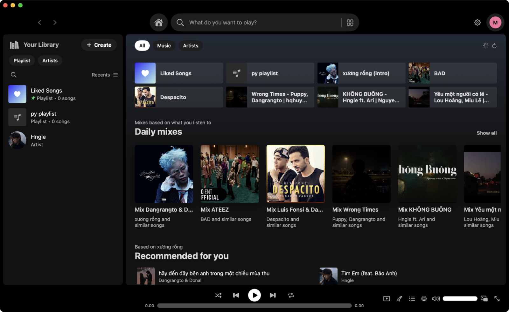
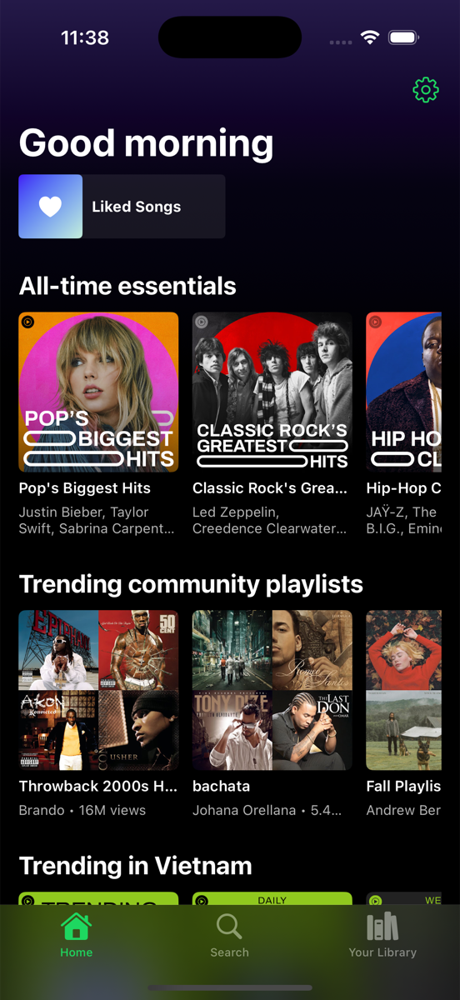
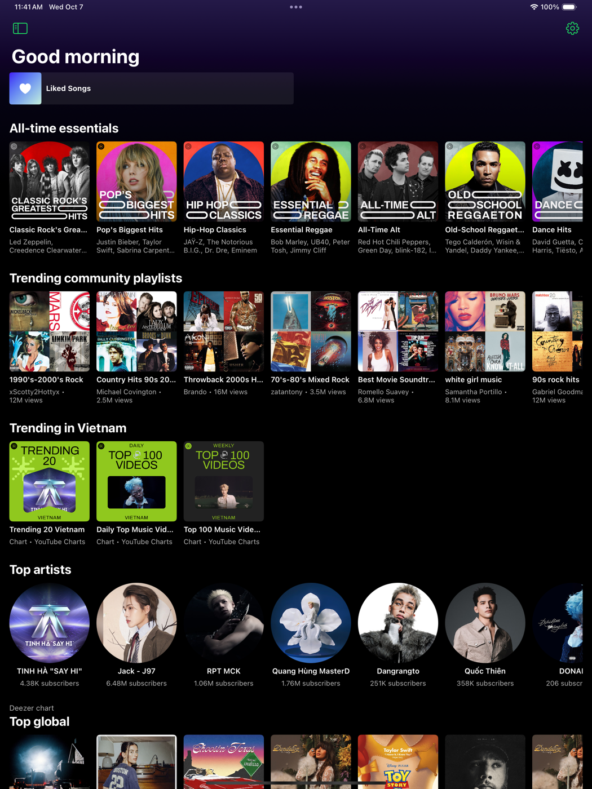
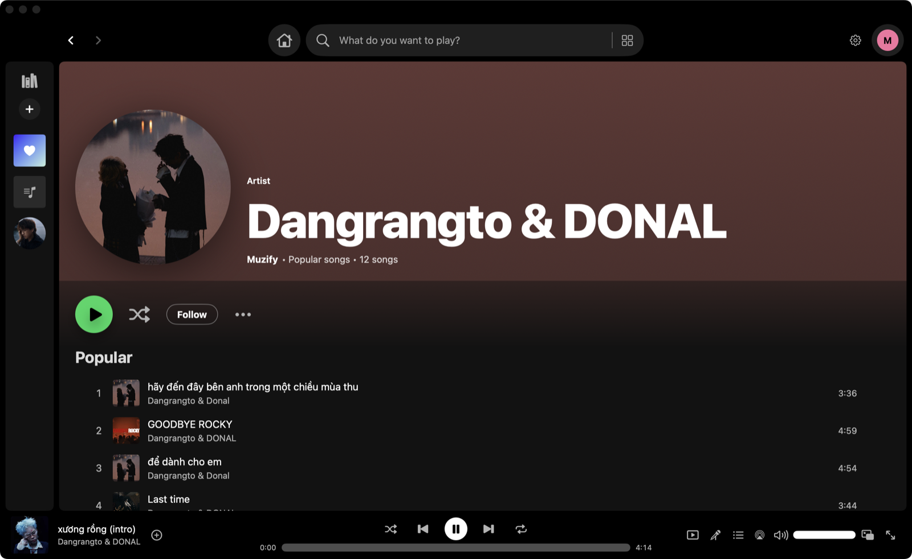

<p align="center">
  
</p>

<h1 align="center">Muzify</h1>

<p align="center">
  A free music player for <b>macOS</b>, <b>iPhone</b> and <b>iPad</b> with a Spotify-style interface.<br>
  Native Swift &amp; SwiftUI · no account · your library stays on your device.
</p>

<p align="center">
  
  
  
  
  <a href="LICENSE"></a>
</p>

<p align="center"><a href="README.vi.md">Tiếng Việt</a></p>



## Platforms

| Platform | Status | Layout |
|---|---|---|
| **macOS 14+** (Apple Silicon & Intel) | Supported | Spotify desktop layout: library sidebar · main view · Now Playing panel · player bar, menu-bar mini player, floating mini player |
| **iPhone (iOS 17+)** | Supported | Tab bar (Home · Search · Library), mini player above the tab bar, full-screen Now Playing |
| **iPad (iPadOS 17+)** | Supported | Spotify-style sidebar + detail view, mini player, full-screen Now Playing |

The iOS app is fully standalone — it does not need the Mac app.

<p align="center">
  
  &nbsp;
  
</p>

## Download

Get the latest build from [**Releases**](https://github.com/not2pixel/Muzify/releases/latest):

- **macOS** — `Muzify.zip`: unzip and drag `Muzify.app` to Applications. The app is not notarized, so the first time **right-click → Open**.
- **iPhone / iPad** — `Muzify.ipa` (unsigned): install with [AltStore](https://altstore.io) or [Sideloadly](https://sideloadly.io); on Apple Silicon Macs you can also run it with [PlayCover](https://playcover.io).

Every push to `main` is built by GitHub Actions (macOS app, iOS app, and a smoke test on iPhone and iPad simulators).

## Features

- **Search everything at once** — your local music + YouTube Music in one list, duplicates removed. SoundCloud and a custom API are also available.
- **Like ≠ Download** (like Spotify): ⊕ saves a song to your library and streams it; downloading for offline listening is separate, per song or per playlist.
- **Home**: daily mixes from what you play, recommendations, YouTube Music shelves, **charts** (Apple Music Vietnam, Deezer global with an Apple Music US fallback). Sections appear as soon as each source loads.
- **Synced lyrics** — YouTube Music first (exact match for the playing video), LRCLIB as fallback, karaoke-style highlighting, tap a line to seek. Lyrics are shifted automatically when an intro is skipped.
- **Skip non-music sections** of music videos (intros, outros, talking) with SponsorBlock.
- **Audio**: 10-band equalizer with presets, volume normalization, AirPlay output.
- **Queue & autoplay**: play next, add to queue, shuffle that reshuffles live, repeat, keeps playing similar songs when the queue ends.
- **Library**: playlists (drag to reorder on Mac), followed artists, import audio files, paste YouTube / YouTube Music / Spotify track links to download.
- **Artist cards** with photo, fan count (Deezer) and bio (Wikipedia).
- **Mac extras**: menu-bar mini player, always-on-top floating player, full-screen player, media keys, Spotify-style shortcuts (Space, ⌘← / ⌘→, ⌘↑ / ⌘↓, ⌘K…), Discord “Listening to…” status.
- **English & Tiếng Việt** — follows the system language or pick one in Settings.



## Build

### macOS

Only the Command Line Tools are needed:

```bash
xcode-select --install        # if you don't have them yet
git clone https://github.com/not2pixel/Muzify.git
cd Muzify
./build.sh --install          # universal build, installs to /Applications
```

`./build.sh` alone produces `build/Muzify.app` and `build/Muzify.zip`. `swift run` starts a development build.

### iPhone / iPad

Requires **Xcode** with the iOS platform. One-time setup:

```bash
sudo xcode-select -s /Applications/Xcode.app/Contents/Developer
sudo xcodebuild -license accept
xcodebuild -downloadPlatform iOS
```

Then:

```bash
Scripts/build_ios.sh          # build/Muzify.ipa (unsigned)
Scripts/build_ios.sh --sim    # build/Muzify-sim.app for the Simulator
Scripts/build_ios.sh --check  # type-check the iOS code on a Mac without Xcode
```

The `.ipa` is unsigned: install it with **PlayCover** (Apple Silicon Macs), **AltStore** or **Sideloadly** (iPhone/iPad, re-sign every 7 days with a free Apple ID).

## How playback works

Muzify reads catalog data (search, home, charts, playlists, lyrics) from YouTube Music's web API and plays audio from YouTube's direct streams, resolved natively in Swift (`Sources/Muzify/Core/YouTubeStream.swift`). On macOS, the open-source [yt-dlp](https://github.com/yt-dlp/yt-dlp) can be installed from Settings as an optional fallback and for downloading links from other websites. ffmpeg (`brew install ffmpeg`) is optional.

## Project layout

```
Sources/Muzify/          macOS app (Swift Package)
  Core/                  shared with iOS: library, player, catalogs, lyrics, EQ, YouTube streams…
  UI/                    macOS interface (Theme, AppState and Tracks are shared with iOS)
  App/                   macOS entry point, menus, shortcuts
Sources/MuzifyMobile/    iPhone / iPad interface
Resources/               Info.plist, icons, translations (en.lproj, vi.lproj), iOS/
Scripts/                 build_ios.sh, l10n.py, en_strings.py, make_icon.swift
docs/                    architecture notes, screenshots
```

See [docs/ARCHITECTURE.md](docs/ARCHITECTURE.md) for details.

## Data & privacy

- Everything stays on your device: `~/Library/Application Support/Muzify/` on macOS, the app container on iOS (also visible in the Files app). No account, no Muzify server, no analytics.
- Settings live in `UserDefaults` (`com.products.muzify` / `com.products.muzify.ios`).
- Playback log for troubleshooting: `~/Library/Logs/Muzify.log`.
- Network access only for what you use: YouTube Music / YouTube, SoundCloud, lyrics (LRCLIB), charts (Apple Music RSS, Deezer), artist info (Deezer, Wikipedia), SponsorBlock, Discord (local IPC).

## Contributing

Muzify is bilingual. UI text is written in Vietnamese inside `L("…")` and the English goes into `Scripts/en_strings.py`; docs come in pairs (`NAME.md` English + `NAME.vi.md` Vietnamese). Before sending a change:

```bash
python3 Scripts/l10n.py check     # 0 missing translations
swift build                       # macOS builds
Scripts/build_ios.sh --check      # iOS code type-checks
```

Agents and contributors: the full rules are in [CLAUDE.md](CLAUDE.md) (mirrored in [AGENTS.md](AGENTS.md)).

## Notes

Muzify uses unofficial web interfaces of YouTube Music, YouTube and SoundCloud; these services may change at any time. Only download content you have the right to use. Lyrics by [LRCLIB](https://lrclib.net) and YouTube Music; skip segments by [SponsorBlock](https://sponsor.ajay.app).

Muzify is a personal project and is not affiliated with Spotify, Apple, Google, SoundCloud, Deezer or Discord.

## License

[MIT](LICENSE)
